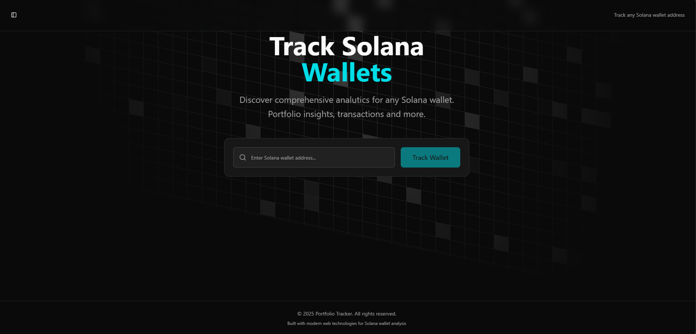

# Solana Wallet Tracker

A modern wallet tracker for solana ecosystem

# 📖 Description

Solana Wallet Tracker is a full-stack application that lets users explore any Solana wallet in detail. It displays live balances (SOL + SPL tokens), recent transactions, and price data — including memecoin swaps — using reliable APIs like Helius and Birdeye.




# 🧰 Tech Stack

###🔧 Backend

- Helius API – Blockchain data and enhanced Solana indexing

- Birdeye API – Real-time token prices and memecoin data

- Express.js – Backend framework

- @solana/web3.js – Solana RPC and account utilities

- PostgreSQL – For optional persistence and caching

### 🎨 Frontend
- React – Modern UI framework

- ShadCN – Accessible and beautiful component library

- Magic UI – Smooth animations and microinteractions


# 🔍 Features
- 🔎 Lookup any Solana wallet by public address

- 💰 Display SOL and SPL token balances

- 📜 View recent transaction history

- 💱 Decode memecoin swaps using BirdEye

- 🌐 Responsive, fast, and clean UI

# ⚙️ Setup Instructions

1. Create .env file in both frontend and backend directories
Include the following credentials:
```cmd
Helius
PostgresDB
BirdEye
```

2. Start the project
You can run frontend and backend independently:
Backend:
```cmd
cd backend
npm install
ts-node index.ts
```
Frontend:

```cmd
cd frontend
npm install
npm run dev
```
